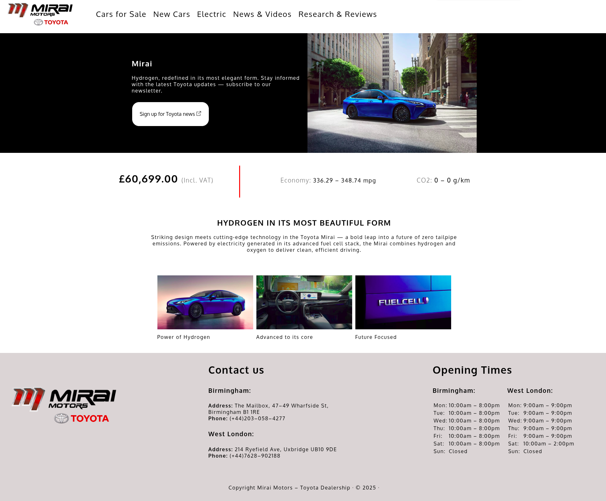

# 🚗 Mirai Motors – Toyota Dealership Homepage


[](https://github.com/ArekKrak/company-page)

A responsive homepage built with **HTML5** and **CSS3 (Flexbox)** as part of Codecademy’s *Challenge Project: Company Home Page with Flexbox*.  

The site is designed as a mock homepage for a **Toyota dealership** promoting the **Toyota Mirai** hydrogen car. It demonstrates responsive layout techniques, modern web typography, clean structure, and basic interactivity.

---

## Project Overview

**Context:**  
This project was created to practice **flexbox-based layouts** and responsive web design. The homepage simulates a dealership website with product highlights, pricing details, imagery, and contact information.

**Your role:**  
Build a homepage layout using **Flexbox** and **media queries** to ensure the site looks good across desktop, tablet, and mobile devices.

**Main Features Implemented:**
- A responsive **header** with logo and navigation bar.  
- A **hero section** highlighting the Toyota Mirai, with call-to-action button.  
- A **pricing and specs** section showing price, fuel economy, and CO₂ data.  
- A **mission statement** with descriptive text.  
- An **image showcase** gallery with captions.  
- A **footer** including contact details, opening hours, and dealership locations.  
- Responsive **Flexbox layout** with multiple breakpoints (`540px`, `703px`, `955px`, `1331px`) for fluid design.

---

## Tech Stack

- **HTML5** (semantic structure)
- **CSS3** (Flexbox, media queries)
- **JavaScript** (dark mode toggle, experimental)
- **Tools**: Visual Studio Code, Git, GitHub

---

## Project Structure

```
company-page/
├── index.html  # Main HTML file
├── styles.css  # CSS stylesheet
├── main.js     # JavaScript (dark mode functionality WIP)
├── img/        # Images and logos
└── README.md   # Project documentation
```

---

## How It Works

1. **Header & Navigation**  
    - Toyota logo + navigation links (Cars for Sale, New Cars, Electric, News & Videos, Research & Reviews).  
    - Flexbox layout that collapses into a stacked menu on smaller screens.  

2. **Hero Section (Mirai intro)**  
    - Large product image of the Toyota Mirai with tagline and call-to-action button.  
    - Responsive text and image placement.  

3. **Pricing & Specs**  
    - Price with VAT, fuel economy, and WLTP CO₂ values displayed in flex columns.  
    - Adjusts to vertical layout on smaller screens.  

4. **Mission Statement**  
    - Highlights Toyota’s hydrogen technology vision with styled typography.  

5. **Image Gallery**  
    - Flexbox grid with product shots and captions (“Power of Hydrogen”, “Advanced to its core”, “Future Focused”).  

6. **Footer**  
    - Contact details for Birmingham and West London dealerships.  
    - Opening hours displayed in tables.  
    - Responsive adjustments: stacked layout on smaller devices.

7. **Dark Mode (Work in Progress)**  
    - A toggle button allows switching between light and dark themes.  
    - Currently functional, but styling refinements still in progress.

---

## How to Run

1. Clone the repository:
```
  git clone https://github.com/ArekKrak/company-page.git
  cd company-page
```
2. Open the project

    - Simply open ```index.html``` in your web browser.

    - Or use a live server (e.g., VS Code Live Server extension) for best results.

## Example Screenshots



---

## Key Concepts Demonstrated

- Semantic **HTML5 structure**
- Responsive layouts with **CSS Flexbox**
- Media queries for different screen sizes
- Typography and spacing for modern design
- Use of images and captions in a grid layout
- Responsive footer with contact details and tables
- **JavaScript basics**: DOM manipulation & event handling for theme toggling

---

## Updates

This section records additions that go beyond the original project scope:

- **Dark Mode Toggle (JavaScript, WIP):**  
  Implemented a theme switcher using JavaScript (`main.js`).  
  The toggle button allows switching between light and dark themes.  
  Functionality works, but styling refinements are still in progress.

---

## Future Improvements

- Add a responsive hamburger menu for navigation.
- Enhance typography with additional Google Fonts.
- Optimize images for faster load times.
- Add animations/transitions for hover effects and call-to-action buttons.
- Convert the layout into a full multi-page site with car listings and reviews.

---

## Acknowledgements

- Project brief provided by Codecademy.
- Inspired by Toyota’s design language and marketing content.
- All logos and images used for educational purposes only.

---

## Contact
If you're a recruiter, mentor, or fellow developer interested in collaboration or feedback:

**Arek Krakowiak**  
[369arek12@protonmail.com](mailto:369arek12@protonmail.com)

---

🚗 Thank you for viewing this project!